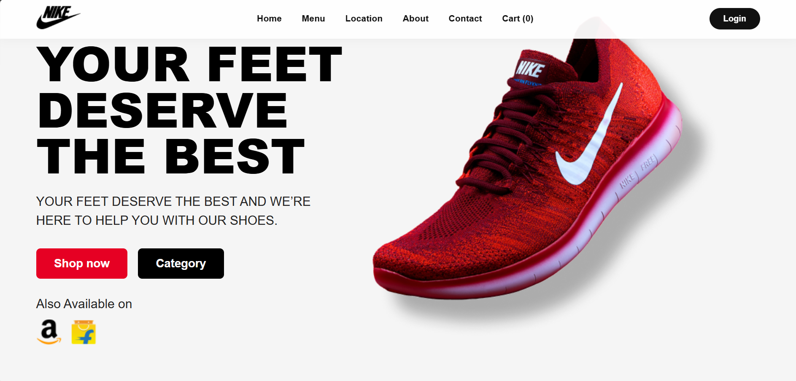
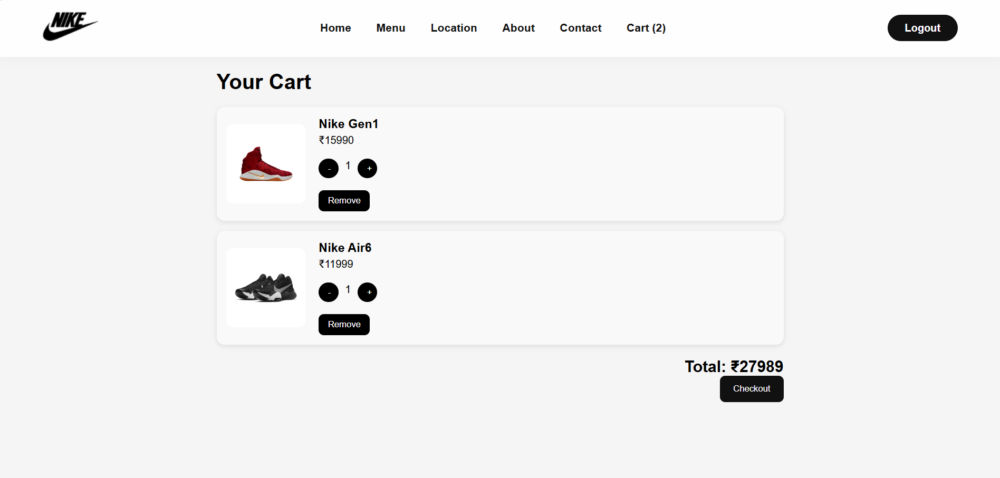
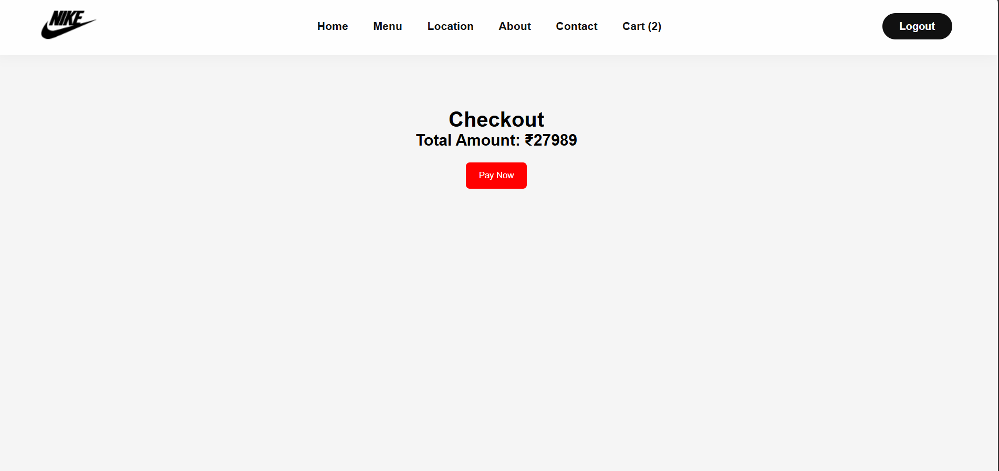

# Nike Clone Ecommerce


A modern full-stack Nike-inspired ecommerce web application built using React, Node.js, Express, and MongoDB.

---

## Features

- User Authentication
- Product Browsing
- Product Details Page
- Add to Cart
- Quantity Management
- Checkout Flow
- Payment Success Page
- Responsive UI
- Modern Nike-inspired Design

---

## Tech Stack

### Frontend
- React.js
- React Router
- CSS3
- Vite

### Backend
- Node.js
- Express.js
- MongoDB

---

## Screenshots

### Home Page


### Products Page


### Cart Page


### Checkout Page


### Login Page


### Payment Success


---

## Installation

### Frontend

```bash
cd project1
npm install
npm run dev
```

### Backend

```bash
cd backend
npm install
npm start
```

---

## Future Improvements

- Razorpay Payment Integration
- Order History
- Admin Dashboard
- Wishlist Feature
- Product Search & Filters

---

## Author
Swaroop Malava


