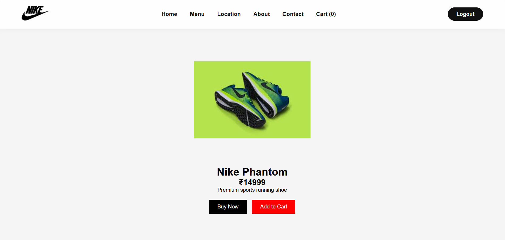
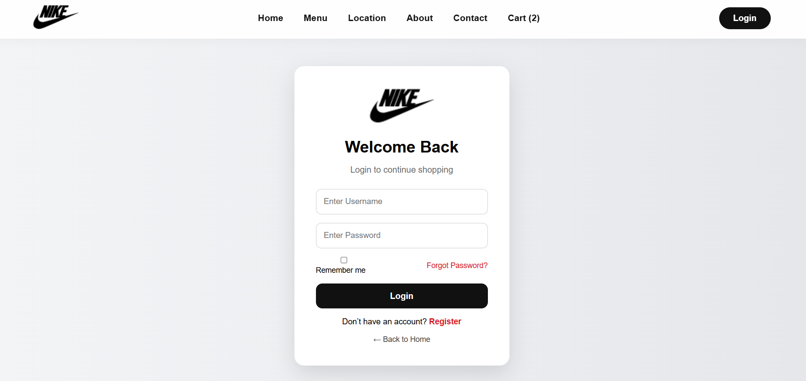
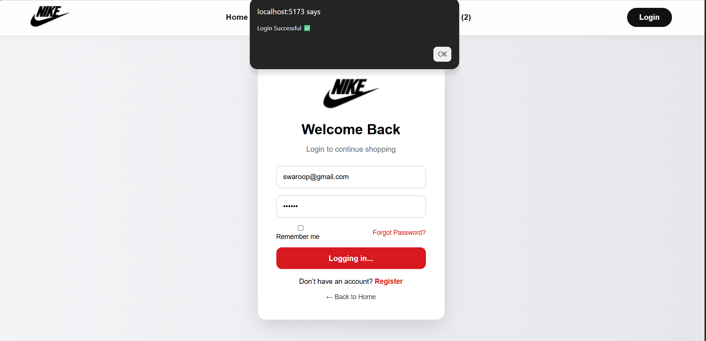
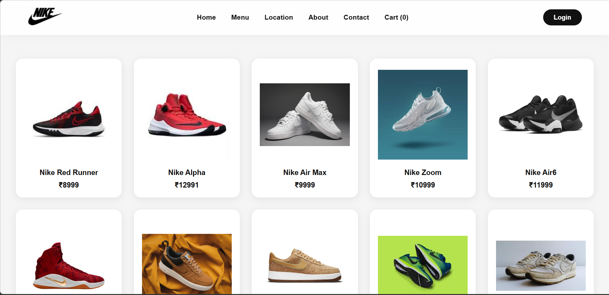
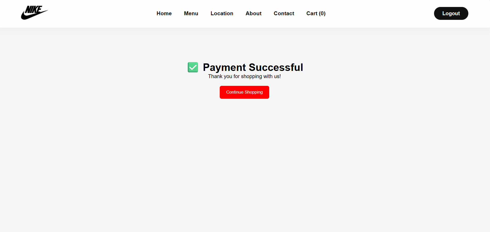
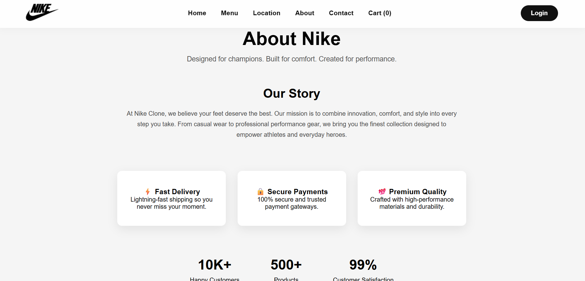
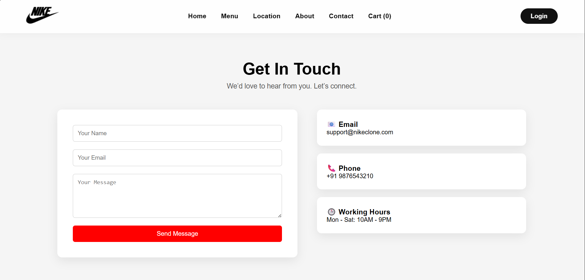
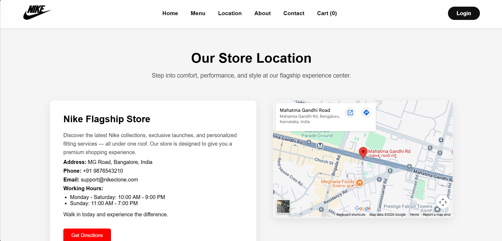

# Nike Clone Ecommerce


A modern full-stack Nike-inspired ecommerce web application built using React, Node.js, Express.js, and MongoDB with authentication, cart management, checkout flow, and responsive UI.

---

# Features

- User Authentication
- Product Browsing
- Product Details Page
- Add to Cart Functionality
- Cart Quantity Management
- Checkout Flow
- Payment Success Page
- Responsive Design
- Modern Nike-inspired UI
- Smooth Navigation & Hover Effects

---

# Tech Stack

## Frontend
- React.js
- React Router DOM
- CSS3
- Vite

## Backend
- Node.js
- Express.js
- MongoDB

---

# Screenshots

## Home Page


## Products Page


## Cart Page


## Checkout Page


## Login Page


## Login Details Page


## Product Details Page


## Payment Success Page


## About Page


## Contact Page


## Location Page


---

# Installation

## Frontend Setup

```bash
cd project1
npm install
npm run dev
```

## Backend Setup

```bash
cd backend
npm install
npm start
```

---

# Future Improvements

- Razorpay Payment Integration
- Wishlist Functionality
- Product Search & Filters
- Admin Dashboard
- Order History
- User Profile Management

---

# Author
Swaroop Malava